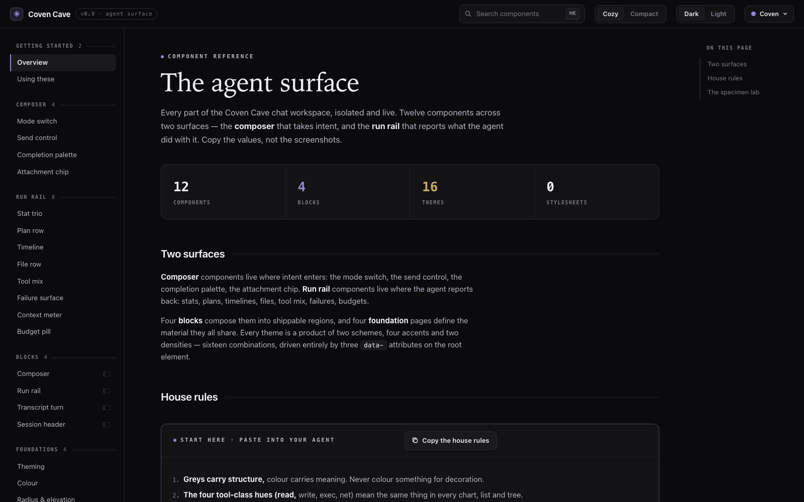

<div align="center">

# OpenCoven UI

**A self-contained component library and specimen lab for the OpenCoven agent surface.**

[**View the live component library →**](https://ui.opencoven.ai)



</div>

---

## What this repository is

OpenCoven UI is a small, inspectable workspace for exploring interface
direction before it enters a production application. It ships two artifacts,
both single HTML files with no dependency installation or build step:

| Artifact | Route | Purpose |
| --- | --- | --- |
| [`index.html`](index.html) | `/` | **The component library** — 12 components, 4 blocks, and 4 foundation pages, each with live Preview / Code / Prompt specimens, search, dark/light schemes, four accents, and two densities. |
| [`Components.dc.html`](Components.dc.html) | `/lab` | **The specimen lab** — the original five-state browser showing Composer, Messages, Context, Actions, and Cards as full assembled scenes. |

This repository is not a packaged npm library, production app, or canonical
source for [Coven Cave](https://github.com/OpenCoven/coven-cave) components.

## The component library

The library documents the agent surface across five sidebar sections:

| Section | Contents |
| --- | --- |
| **Getting started** | Overview with the house rules, and the CLI / prompt paths in. |
| **Composer** | Mode switch, send control, completion palette, attachment chip. |
| **Run rail** | Stat trio, plan row, timeline, file row, tool mix, failure surface, context meter, budget pill. |
| **Blocks** | Composer, run rail, transcript turn, session header — assembled regions. |
| **Foundations** | Theming, color, radius & elevation, type & motion. |

Every component page carries a live **Preview**, the exact **Code**, and a
paste-ready **Prompt** spec that lets a coding agent reproduce the component
without seeing this site. The top-bar toggles drive three root attributes
(`data-theme`, `data-accent`, `data-density`) for sixteen theme combinations,
persisted in `localStorage`. Search filters the sidebar; `⌘K` focuses it.

## The specimen lab

The lab (`/lab`) preserves the five assembled interface states:

| State | Purpose |
| --- | --- |
| **Composer** | Keeps drafting, context, model, and send controls legible without competing with the message. |
| **Messages** | Presents a familiar response as an editorial turn with clear identity, provenance, response, and utility hierarchy. |
| **Context** | Makes attached repositories, files, branches, and access state explicit. |
| **Actions** | Uses direct verbs, visible consequences, and secondary keyboard cues. |
| **Cards** | Embeds in-message artifacts — pull requests, pending proposals, attachments, and handoffs — with kind, state, and provenance visible, and pending writes never presented as performed. |

Both artifacts preserve visible focus states, keyboard navigation,
reduced-motion handling, and a responsive layout without horizontal overflow
at 390px.

## Open locally

```bash
git clone https://github.com/OpenCoven/ui.git
cd ui
open index.html            # the library
open Components.dc.html    # the lab
```

No install step is required. On platforms without the macOS `open` command,
open the files directly in a browser.

## Run the dev server

Opening the files directly works, but a local server reproduces the deployed
routing. [`scripts/dev.py`](scripts/dev.py) applies the same rewrites as
[`vercel.json`](vercel.json), so `/` serves the library and `/lab` serves the
specimen lab exactly as on [ui.opencoven.ai](https://ui.opencoven.ai).

```bash
python3 scripts/dev.py        # http://127.0.0.1:4321/
python3 scripts/dev.py 5173   # or pass a port
```

Only the Python 3 standard library is used, and responses are sent with
`Cache-Control: no-store` so edits appear on reload.

## Repository map

| Path | Purpose |
| --- | --- |
| [`index.html`](index.html) | Self-contained component library (site root) |
| [`Components.dc.html`](Components.dc.html) | Self-contained five-state specimen lab (`/lab`) |
| [`scripts/dev.py`](scripts/dev.py) | Dependency-free local dev server with the production rewrites |
| [`artifacts/`](artifacts/) | Verified desktop and mobile visual receipts |
| [`docs/superpowers/specs/`](docs/superpowers/specs/) | Approved design decisions |
| [`docs/superpowers/plans/`](docs/superpowers/plans/) | Implementation plans and verification steps |
| [`handoffs/`](handoffs/) | Completion and validation receipts |

## Contributing

When changing either artifact:

1. Keep both artifacts self-contained unless a separately approved design
   changes the repository architecture.
2. In the library, preserve the sidebar section semantics and give every
   component page a Preview, Code, and Prompt specimen.
3. In the lab, preserve all five states and the existing navigation semantics.
4. Verify embedded JavaScript parsing, navigation, search, theme/density/accent
   toggles, and 390px horizontal overflow.
5. Refresh both desktop and mobile screenshots when visual behavior changes.
6. Record exact commands and results in the relevant handoff receipt.

The current
[implementation plan](docs/superpowers/plans/2026-08-17-components-messages-editorial-state.md)
contains the exact specimen verification commands.

## Design provenance

- [Editorial Messages design](docs/superpowers/specs/2026-08-17-components-messages-editorial-state-design.md)
- [Editorial Messages implementation plan](docs/superpowers/plans/2026-08-17-components-messages-editorial-state.md)
- [Repository README design](docs/superpowers/specs/2026-08-17-repository-readme-design.md)
