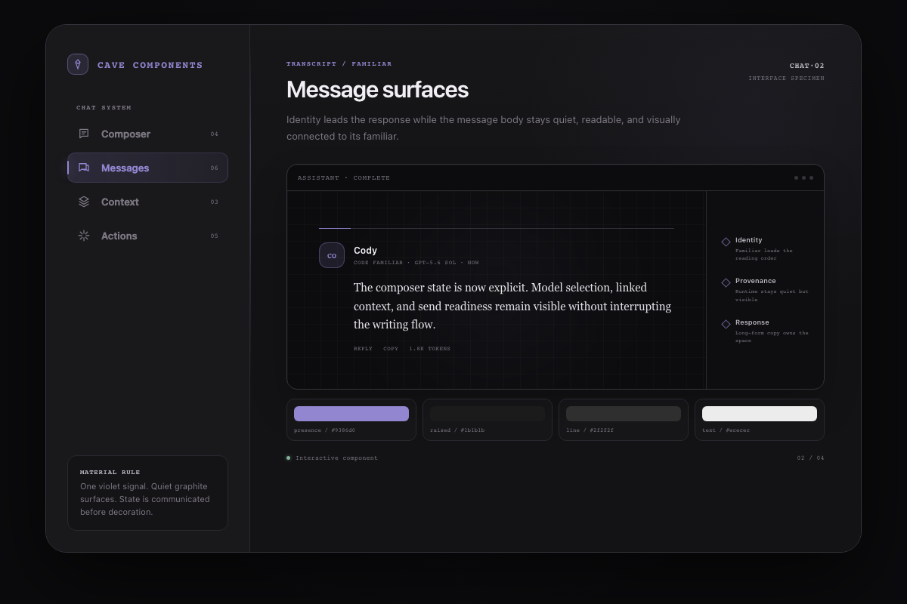
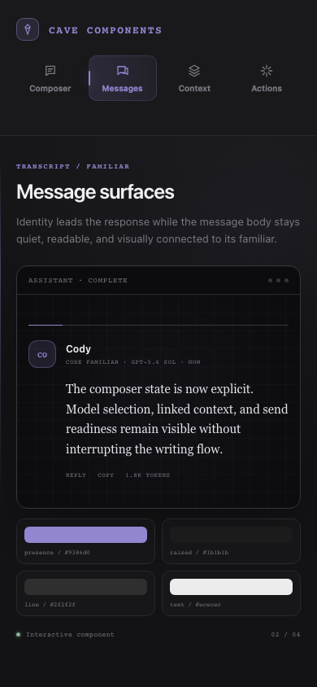

<div align="center">

# OpenCoven UI

**Standalone interface specimens and design artifacts for OpenCoven.**

[**View the live component browser →**](https://ui.opencoven.ai)



</div>

---

## What this repository is

OpenCoven UI is a small, inspectable workspace for exploring interface
direction before it enters a production application. The current artifact,
[`Components.dc.html`](Components.dc.html), is a self-contained HTML, CSS, and
JavaScript component browser with no dependency installation or build step.

This repository is not a packaged component library, production app, or
canonical source for [Coven Cave](https://github.com/OpenCoven/coven-cave)
components.

## Component states

Use the specimen navigation to move between four interface states:

| State | Purpose |
| --- | --- |
| **Composer** | Keeps drafting, context, model, and send controls legible without competing with the message. |
| **Messages** | Presents a familiar response as an editorial turn with clear identity, provenance, response, and utility hierarchy. |
| **Context** | Makes attached repositories, files, branches, and access state explicit. |
| **Actions** | Uses direct verbs, visible consequences, and secondary keyboard cues. |

The browser preserves visible focus states, arrow-key navigation, reduced-motion
handling, and a responsive layout without horizontal overflow at 390px.

## Open locally

```bash
git clone https://github.com/OpenCoven/ui.git
cd ui
open Components.dc.html
```

No install step is required. On platforms without the macOS `open` command,
open `Components.dc.html` directly in a browser.

## Responsive behavior

The same Messages hierarchy contracts naturally on narrow screens while keeping
the response aligned beneath Cody's identity.

<div align="center">
  
</div>

## Repository map

| Path | Purpose |
| --- | --- |
| [`Components.dc.html`](Components.dc.html) | Self-contained interactive component browser |
| [`artifacts/`](artifacts/) | Verified desktop and mobile visual receipts |
| [`docs/superpowers/specs/`](docs/superpowers/specs/) | Approved design decisions |
| [`docs/superpowers/plans/`](docs/superpowers/plans/) | Implementation plans and verification steps |
| [`handoffs/`](handoffs/) | Completion and validation receipts |

## Contributing

When changing a specimen:

1. Keep the browser self-contained unless a separately approved design changes
   the repository architecture.
2. Preserve all four states and the existing navigation semantics.
3. Verify embedded JavaScript parsing, four-state selection, arrow-key
   navigation, and 390px horizontal overflow.
4. Refresh both desktop and mobile screenshots when visual behavior changes.
5. Record exact commands and results in the relevant handoff receipt.

The current
[implementation plan](docs/superpowers/plans/2026-08-17-components-messages-editorial-state.md)
contains the exact specimen verification commands.

## Design provenance

- [Editorial Messages design](docs/superpowers/specs/2026-08-17-components-messages-editorial-state-design.md)
- [Editorial Messages implementation plan](docs/superpowers/plans/2026-08-17-components-messages-editorial-state.md)
- [Repository README design](docs/superpowers/specs/2026-08-17-repository-readme-design.md)
